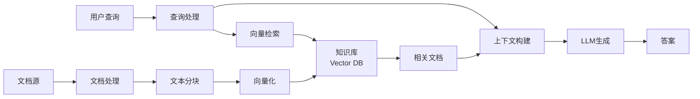

在大语言模型(LLM)快速发展的今天，我们面临一个核心挑战：如何让模型能够访问和利用实时、专业或私有的知识？纯粹依赖预训练的模型往往会出现知识过时、幻觉问题，或者无法回答特定领域的问题。这就是检索增强生成(Retrieval-Augmented Generation, RAG)技术应运而生的原因。

RAG通过将外部知识库的检索能力与LLM的生成能力相结合，为这个问题提供了一个优雅的解决方案。它不需要重新训练模型，就能让AI系统访问最新的、特定领域的知识，同时显著降低幻觉问题。本文将深入探讨RAG的核心原理、架构设计以及实际应用中的最佳实践。

<!--more-->

## RAG的核心思想

RAG的基本思想非常直观：在生成答案之前，先从知识库中检索相关信息，然后将这些信息作为上下文提供给LLM，让模型基于这些事实进行回答。

这个过程可以类比为开卷考试：传统的LLM就像闭卷考试，只能依赖记忆中的知识；而RAG系统则像开卷考试，可以查阅参考资料后再作答，答案自然更加准确和可靠。

### RAG vs 其他方案

让我们先比较几种常见的知识增强方案：

| 方案 | 优势 | 劣势 | 适用场景 |
|------|------|------|----------|
| **预训练** | 知识内化在模型中，推理速度快 | 知识固化，无法更新，成本高昂 | 通用知识 |
| **微调(Fine-tuning)** | 可以学习特定领域知识和风格 | 需要大量数据和计算资源，知识仍会过时 | 特定任务或领域 |
| **RAG** | 知识可实时更新，成本低，透明可解释 | 检索质量影响结果，增加延迟 | 动态知识、事实性回答 |
| **长上下文** | 简单直接，无需额外系统 | 成本高，注意力衰减，token限制 | 小规模文档 |

RAG的核心优势在于**知识与模型的解耦**：你可以随时更新知识库而无需重新训练模型，这使得系统具有极高的灵活性和可维护性。

## RAG系统架构

一个完整的RAG系统通常包含以下几个核心组件：



### 1. 文档索引流程 (Indexing Pipeline)

这是RAG系统的准备阶段，负责将原始文档转换为可检索的格式。

#### 文档加载与预处理

```python
from typing import List
import re

class DocumentLoader:
    """文档加载器，支持多种格式"""

    def load_pdf(self, file_path: str) -> str:
        """加载PDF文档"""
        # 使用PyPDF2或pdfplumber
        import pdfplumber

        text = ""
        with pdfplumber.open(file_path) as pdf:
            for page in pdf.pages:
                text += page.extract_text()
        return text

    def load_markdown(self, file_path: str) -> str:
        """加载Markdown文档"""
        with open(file_path, 'r', encoding='utf-8') as f:
            return f.read()

    def preprocess(self, text: str) -> str:
        """文本预处理：清理、标准化"""
        # 移除多余空白
        text = re.sub(r'\s+', ' ', text)
        # 移除特殊字符
        text = re.sub(r'[\x00-\x08\x0b-\x0c\x0e-\x1f\x7f-\x9f]', '', text)
        return text.strip()
```

#### 文本分块策略

文本分块(Chunking)是RAG系统中最关键的步骤之一。分块策略直接影响检索质量和生成效果。

```python
class TextChunker:
    """智能文本分块器"""

    def __init__(self, chunk_size: int = 512, chunk_overlap: int = 50):
        """
        Args:
            chunk_size: 每个块的目标大小(tokens)
            chunk_overlap: 块之间的重叠大小，用于保持上下文连贯性
        """
        self.chunk_size = chunk_size
        self.chunk_overlap = chunk_overlap

    def chunk_by_tokens(self, text: str) -> List[str]:
        """基于token数量进行分块"""
        # 使用tokenizer计算token数量
        from transformers import AutoTokenizer

        tokenizer = AutoTokenizer.from_pretrained("sentence-transformers/all-MiniLM-L6-v2")
        tokens = tokenizer.encode(text)

        chunks = []
        start = 0

        while start < len(tokens):
            # 提取当前块
            end = start + self.chunk_size
            chunk_tokens = tokens[start:end]

            # 解码为文本
            chunk_text = tokenizer.decode(chunk_tokens, skip_special_tokens=True)
            chunks.append(chunk_text)

            # 移动到下一个块，考虑重叠
            start += self.chunk_size - self.chunk_overlap

        return chunks

    def chunk_by_semantic(self, text: str) -> List[str]:
        """基于语义边界进行分块（更智能）"""
        # 按段落分割
        paragraphs = text.split('\n\n')

        chunks = []
        current_chunk = ""
        current_size = 0

        for para in paragraphs:
            para_size = len(para.split())  # 简化的token估计

            # 如果当前块加上新段落不会太大，合并
            if current_size + para_size <= self.chunk_size:
                current_chunk += "\n\n" + para if current_chunk else para
                current_size += para_size
            else:
                # 保存当前块，开始新块
                if current_chunk:
                    chunks.append(current_chunk.strip())
                current_chunk = para
                current_size = para_size

        # 添加最后一个块
        if current_chunk:
            chunks.append(current_chunk.strip())

        return chunks
```

**分块策略的选择**：

- **固定大小分块**：简单快速，但可能在句子中间截断
- **语义分块**：尊重文档结构（段落、章节），保持语义完整性
- **滑动窗口**：使用重叠区域避免信息丢失
- **递归分块**：先按大结构（章节）分，再细分，适合长文档

#### 向量化与索引

```python
from typing import List, Dict
import numpy as np
from sentence_transformers import SentenceTransformer

class EmbeddingEngine:
    """文本向量化引擎"""

    def __init__(self, model_name: str = "sentence-transformers/all-MiniLM-L6-v2"):
        """
        初始化嵌入模型

        常用模型选择：
        - all-MiniLM-L6-v2: 轻量级，速度快，384维
        - all-mpnet-base-v2: 性能更好，768维
        - text-embedding-ada-002: OpenAI模型，1536维
        """
        self.model = SentenceTransformer(model_name)
        self.dimension = self.model.get_sentence_embedding_dimension()

    def embed_documents(self, texts: List[str]) -> np.ndarray:
        """批量向量化文档"""
        # 使用批处理提高效率
        embeddings = self.model.encode(
            texts,
            batch_size=32,
            show_progress_bar=True,
            convert_to_numpy=True
        )
        return embeddings

    def embed_query(self, query: str) -> np.ndarray:
        """向量化查询"""
        return self.model.encode(query, convert_to_numpy=True)
```

### 2. 检索流程 (Retrieval Pipeline)

检索是RAG的核心，目标是找到与用户查询最相关的文档片段。

#### 向量数据库集成

```python
from typing import List, Tuple
import chromadb
from chromadb.config import Settings

class VectorStore:
    """向量数据库封装"""

    def __init__(self, collection_name: str = "documents"):
        """初始化Chroma向量数据库"""
        self.client = chromadb.Client(Settings(
            chroma_db_impl="duckdb+parquet",
            persist_directory="./chroma_db"
        ))

        self.collection = self.client.get_or_create_collection(
            name=collection_name,
            metadata={"hnsw:space": "cosine"}  # 使用余弦相似度
        )

    def add_documents(
        self,
        texts: List[str],
        embeddings: np.ndarray,
        metadatas: List[Dict] = None
    ):
        """添加文档到向量库"""
        ids = [f"doc_{i}" for i in range(len(texts))]

        self.collection.add(
            ids=ids,
            embeddings=embeddings.tolist(),
            documents=texts,
            metadatas=metadatas or [{}] * len(texts)
        )

    def search(
        self,
        query_embedding: np.ndarray,
        top_k: int = 5
    ) -> Tuple[List[str], List[float], List[Dict]]:
        """
        检索最相关的文档

        Returns:
            documents: 检索到的文本列表
            distances: 相似度分数列表
            metadatas: 元数据列表
        """
        results = self.collection.query(
            query_embeddings=[query_embedding.tolist()],
            n_results=top_k
        )

        return (
            results['documents'][0],
            results['distances'][0],
            results['metadatas'][0]
        )
```

#### 高级检索技术

##### 1. 混合检索 (Hybrid Search)

结合向量检索和传统关键词检索，可以显著提升检索质量。

```python
from rank_bm25 import BM25Okapi
import numpy as np

class HybridRetriever:
    """混合检索器：结合向量检索和BM25"""

    def __init__(self, vector_store: VectorStore, documents: List[str]):
        self.vector_store = vector_store
        self.documents = documents

        # 初始化BM25
        tokenized_docs = [doc.lower().split() for doc in documents]
        self.bm25 = BM25Okapi(tokenized_docs)

    def search(
        self,
        query: str,
        query_embedding: np.ndarray,
        top_k: int = 5,
        alpha: float = 0.5
    ) -> List[Tuple[str, float]]:
        """
        混合检索

        Args:
            alpha: 向量检索的权重 (0-1)，1-alpha为BM25权重
        """
        # 向量检索
        vec_docs, vec_scores, _ = self.vector_store.search(
            query_embedding,
            top_k=top_k * 2  # 检索更多候选
        )

        # BM25检索
        tokenized_query = query.lower().split()
        bm25_scores = self.bm25.get_scores(tokenized_query)

        # 归一化分数
        vec_scores = np.array(vec_scores)
        vec_scores = (vec_scores - vec_scores.min()) / (vec_scores.max() - vec_scores.min() + 1e-10)

        bm25_scores = (bm25_scores - bm25_scores.min()) / (bm25_scores.max() - bm25_scores.min() + 1e-10)

        # 合并分数
        combined_scores = {}
        for doc, score in zip(vec_docs, vec_scores):
            if doc in self.documents:
                idx = self.documents.index(doc)
                combined_scores[doc] = alpha * score + (1 - alpha) * bm25_scores[idx]

        # 排序并返回top-k
        sorted_results = sorted(
            combined_scores.items(),
            key=lambda x: x[1],
            reverse=True
        )[:top_k]

        return sorted_results
```

##### 2. 重排序 (Reranking)

使用更强大的模型对初步检索结果进行重新排序。

```python
from sentence_transformers import CrossEncoder

class Reranker:
    """重排序器"""

    def __init__(self, model_name: str = "cross-encoder/ms-marco-MiniLM-L-6-v2"):
        """
        初始化交叉编码器模型
        CrossEncoder直接计算query-document对的相关性分数
        """
        self.model = CrossEncoder(model_name)

    def rerank(
        self,
        query: str,
        documents: List[str],
        top_k: int = 5
    ) -> List[Tuple[str, float]]:
        """
        重排序文档

        Args:
            query: 用户查询
            documents: 候选文档列表
            top_k: 返回前k个结果
        """
        # 构建query-document对
        pairs = [[query, doc] for doc in documents]

        # 计算相关性分数
        scores = self.model.predict(pairs)

        # 排序
        ranked_results = sorted(
            zip(documents, scores),
            key=lambda x: x[1],
            reverse=True
        )[:top_k]

        return ranked_results
```

##### 3. 查询改写 (Query Rewriting)

优化用户查询以提升检索效果。

```python
from typing import List
import openai

class QueryRewriter:
    """查询改写器"""

    def __init__(self, api_key: str):
        openai.api_key = api_key

    def expand_query(self, query: str) -> List[str]:
        """
        生成多个查询变体以提高召回率

        例如："什么是RAG？"
        可能生成：
        - "RAG的定义是什么"
        - "检索增强生成技术"
        - "Retrieval-Augmented Generation原理"
        """
        prompt = f"""
        Given the user query: "{query}"

        Generate 3 alternative phrasings of this query that would help retrieve relevant information.
        Each alternative should focus on different aspects or use different terminology.

        Return only the alternative queries, one per line.
        """

        response = openai.ChatCompletion.create(
            model="gpt-3.5-turbo",
            messages=[{"role": "user", "content": prompt}],
            temperature=0.7
        )

        alternatives = response.choices[0].message.content.strip().split('\n')
        return [query] + alternatives  # 包含原始查询

    def extract_keywords(self, query: str) -> List[str]:
        """提取关键词用于BM25检索"""
        # 简化版本：可以使用NLP库如spaCy进行更精确的提取
        stopwords = {'的', '是', '在', '了', '和', '与', '或', '什么', '如何', '为什么'}
        words = query.lower().split()
        keywords = [w for w in words if w not in stopwords]
        return keywords
```

### 3. 生成流程 (Generation Pipeline)

检索到相关文档后，需要构建合适的prompt并调用LLM生成答案。

```python
from typing import List, Dict, Optional
import openai

class RAGGenerator:
    """RAG生成器"""

    def __init__(
        self,
        api_key: str,
        model: str = "gpt-4",
        temperature: float = 0.1
    ):
        openai.api_key = api_key
        self.model = model
        self.temperature = temperature

    def build_context(
        self,
        documents: List[str],
        max_tokens: int = 2000
    ) -> str:
        """
        构建上下文，控制token数量

        策略：
        1. 优先包含最相关的文档
        2. 确保不超过max_tokens限制
        3. 保持文档完整性
        """
        context_parts = []
        current_tokens = 0

        for i, doc in enumerate(documents):
            # 简化的token估计
            doc_tokens = len(doc.split()) * 1.3  # 英文约1.3 tokens per word

            if current_tokens + doc_tokens > max_tokens:
                break

            context_parts.append(f"[Document {i+1}]\n{doc}\n")
            current_tokens += doc_tokens

        return "\n".join(context_parts)

    def generate(
        self,
        query: str,
        retrieved_docs: List[str],
        system_prompt: Optional[str] = None
    ) -> Dict[str, any]:
        """
        生成答案

        Returns:
            包含answer和metadata的字典
        """
        # 构建上下文
        context = self.build_context(retrieved_docs)

        # 默认系统提示
        if system_prompt is None:
            system_prompt = """你是一个专业的AI助手。你的任务是基于提供的参考文档回答用户问题。

重要规则：
1. 只使用参考文档中的信息来回答问题
2. 如果文档中没有相关信息，明确告诉用户"根据提供的文档，我无法回答这个问题"
3. 引用具体的文档内容时，注明来源（例如"根据Document 1..."）
4. 保持回答准确、客观、有条理
5. 不要编造或推测文档中没有的信息"""

        # 构建用户消息
        user_message = f"""参考文档：
{context}

用户问题：{query}

请基于上述参考文档回答问题。"""

        # 调用LLM
        response = openai.ChatCompletion.create(
            model=self.model,
            messages=[
                {"role": "system", "content": system_prompt},
                {"role": "user", "content": user_message}
            ],
            temperature=self.temperature,
            max_tokens=1000
        )

        answer = response.choices[0].message.content

        return {
            "answer": answer,
            "context": context,
            "model": self.model,
            "tokens_used": response.usage.total_tokens
        }

    def generate_with_citations(
        self,
        query: str,
        retrieved_docs: List[Tuple[str, float]],  # (document, score)
        metadatas: List[Dict]
    ) -> Dict[str, any]:
        """
        生成带引用的答案
        """
        # 构建带编号的上下文
        context_parts = []
        for i, ((doc, score), metadata) in enumerate(zip(retrieved_docs, metadatas)):
            source = metadata.get('source', 'Unknown')
            context_parts.append(
                f"[{i+1}] (Source: {source}, Relevance: {score:.3f})\n{doc}\n"
            )

        context = "\n".join(context_parts)

        system_prompt = """你是一个专业的AI助手。基于提供的参考文档回答问题，并在答案中使用[数字]标注引用来源。

示例：
问题：RAG有什么优势？
答案：RAG的主要优势包括：1) 可以实时更新知识库而无需重新训练模型[1]，2) 显著降低模型幻觉问题[2]，3) 提供可追溯的信息来源[1]。

规则：
- 使用[1]、[2]等标注引用的文档编号
- 只使用文档中的信息
- 如果无法回答，明确说明"""

        user_message = f"""参考文档：
{context}

用户问题：{query}

请回答问题并标注引用来源。"""

        response = openai.ChatCompletion.create(
            model=self.model,
            messages=[
                {"role": "system", "content": system_prompt},
                {"role": "user", "content": user_message}
            ],
            temperature=self.temperature
        )

        return {
            "answer": response.choices[0].message.content,
            "sources": [meta.get('source', 'Unknown') for meta in metadatas],
            "relevance_scores": [score for _, score in retrieved_docs]
        }
```

## 完整的RAG系统实现

将上述组件整合成一个完整的RAG系统：

```python
class RAGSystem:
    """完整的RAG系统"""

    def __init__(
        self,
        embedding_model: str = "sentence-transformers/all-MiniLM-L6-v2",
        llm_model: str = "gpt-4",
        api_key: str = None
    ):
        # 初始化各个组件
        self.loader = DocumentLoader()
        self.chunker = TextChunker(chunk_size=512, chunk_overlap=50)
        self.embedder = EmbeddingEngine(embedding_model)
        self.vector_store = VectorStore()
        self.reranker = Reranker()
        self.generator = RAGGenerator(api_key, llm_model)

        self.documents = []  # 存储原始文档

    def ingest_documents(self, file_paths: List[str]):
        """
        文档摄入流程

        Args:
            file_paths: 文档文件路径列表
        """
        print("Loading documents...")
        all_chunks = []
        all_metadatas = []

        for file_path in file_paths:
            # 加载文档
            if file_path.endswith('.pdf'):
                text = self.loader.load_pdf(file_path)
            elif file_path.endswith('.md'):
                text = self.loader.load_markdown(file_path)
            else:
                continue

            # 预处理
            text = self.loader.preprocess(text)

            # 分块
            chunks = self.chunker.chunk_by_semantic(text)

            # 记录元数据
            metadatas = [
                {"source": file_path, "chunk_id": i}
                for i in range(len(chunks))
            ]

            all_chunks.extend(chunks)
            all_metadatas.extend(metadatas)

        self.documents = all_chunks

        # 向量化
        print(f"Embedding {len(all_chunks)} chunks...")
        embeddings = self.embedder.embed_documents(all_chunks)

        # 索引
        print("Indexing to vector store...")
        self.vector_store.add_documents(
            texts=all_chunks,
            embeddings=embeddings,
            metadatas=all_metadatas
        )

        print(f"Successfully ingested {len(file_paths)} documents!")

    def query(
        self,
        question: str,
        top_k: int = 5,
        use_reranking: bool = True
    ) -> Dict[str, any]:
        """
        查询RAG系统

        Args:
            question: 用户问题
            top_k: 返回的文档数量
            use_reranking: 是否使用重排序

        Returns:
            包含答案和元数据的字典
        """
        print(f"Query: {question}")

        # 1. 向量化查询
        query_embedding = self.embedder.embed_query(question)

        # 2. 检索
        print("Retrieving relevant documents...")
        retrieved_docs, scores, metadatas = self.vector_store.search(
            query_embedding,
            top_k=top_k * 2 if use_reranking else top_k
        )

        # 3. 重排序（可选）
        if use_reranking:
            print("Reranking documents...")
            reranked = self.reranker.rerank(
                question,
                retrieved_docs,
                top_k=top_k
            )
            retrieved_docs = [doc for doc, _ in reranked]
            scores = [score for _, score in reranked]

        # 4. 生成答案
        print("Generating answer...")
        result = self.generator.generate_with_citations(
            question,
            list(zip(retrieved_docs, scores)),
            metadatas[:len(retrieved_docs)]
        )

        return result

# 使用示例
if __name__ == "__main__":
    # 初始化系统
    rag = RAGSystem(
        api_key="your-openai-api-key"
    )

    # 摄入文档
    rag.ingest_documents([
        "./docs/rag_paper.pdf",
        "./docs/llm_guide.md",
        "./docs/vector_db_intro.pdf"
    ])

    # 查询
    result = rag.query(
        "什么是RAG？它解决了什么问题？",
        top_k=3
    )

    print("\nAnswer:", result['answer'])
    print("\nSources:", result['sources'])
```

## RAG系统的优化策略

### 1. 提升检索质量

#### 查询扩展与改写

```python
class AdvancedQueryProcessor:
    """高级查询处理器"""

    def hypothetical_document_embeddings(self, query: str, llm) -> str:
        """
        HyDE (Hypothetical Document Embeddings)技术

        思路：让LLM生成一个假设性的答案文档，
        然后用这个文档进行检索，往往比直接用query检索效果更好
        """
        prompt = f"""给定问题：{query}

请生成一个详细的、假设性的答案（即使你不确定具体细节）。
这个答案应该包含可能出现在真实答案文档中的关键术语和概念。

假设性答案："""

        hypothetical_doc = llm.generate(prompt)
        return hypothetical_doc

    def multi_query_retrieval(
        self,
        query: str,
        llm,
        retriever
    ) -> List[str]:
        """
        多查询检索：生成多个角度的查询，合并结果
        """
        prompt = f"""给定用户问题：{query}

生成3个不同角度的相关问题，这些问题的答案能够帮助回答原问题。

问题1：
问题2：
问题3："""

        response = llm.generate(prompt)
        queries = [query] + response.strip().split('\n')

        # 对每个查询进行检索
        all_docs = []
        for q in queries:
            docs = retriever.retrieve(q, top_k=3)
            all_docs.extend(docs)

        # 去重
        unique_docs = list(dict.fromkeys(all_docs))
        return unique_docs
```

### 2. 优化分块策略

```python
class AdaptiveChunker:
    """自适应分块器"""

    def chunk_with_context(
        self,
        text: str,
        chunk_size: int = 512
    ) -> List[Dict]:
        """
        带上下文的分块

        每个chunk包含：
        - 主要内容
        - 前置上下文（标题、摘要等）
        - 后续上下文预览
        """
        # 检测文档结构
        sections = self._detect_sections(text)

        chunks = []
        for section in sections:
            title = section['title']
            content = section['content']

            # 分割section内容
            sub_chunks = self._split_by_size(content, chunk_size)

            for i, chunk in enumerate(sub_chunks):
                # 添加上下文信息
                chunk_with_context = {
                    'text': chunk,
                    'title': title,
                    'position': f"{i+1}/{len(sub_chunks)}",
                    'preview_next': sub_chunks[i+1][:100] if i+1 < len(sub_chunks) else ""
                }
                chunks.append(chunk_with_context)

        return chunks

    def _detect_sections(self, text: str) -> List[Dict]:
        """检测文档的章节结构"""
        # 简化版本：基于标题标记
        import re

        # 匹配Markdown标题
        sections = []
        current_section = {"title": "Introduction", "content": ""}

        lines = text.split('\n')
        for line in lines:
            if re.match(r'^#{1,3}\s+', line):
                # 保存当前section
                if current_section['content']:
                    sections.append(current_section)

                # 开始新section
                title = re.sub(r'^#{1,3}\s+', '', line)
                current_section = {"title": title, "content": ""}
            else:
                current_section['content'] += line + '\n'

        # 添加最后一个section
        if current_section['content']:
            sections.append(current_section)

        return sections
```

### 3. 智能上下文压缩

当检索到大量文档时，可能超过LLM的上下文窗口限制。这时需要压缩技术：

```python
class ContextCompressor:
    """上下文压缩器"""

    def __init__(self, llm):
        self.llm = llm

    def extractive_compression(
        self,
        query: str,
        documents: List[str],
        max_length: int = 2000
    ) -> str:
        """
        抽取式压缩：提取最相关的句子
        """
        all_sentences = []
        for doc in documents:
            sentences = doc.split('.')
            all_sentences.extend([(s.strip(), doc) for s in sentences if s.strip()])

        # 计算每个句子与query的相关性
        from sentence_transformers import util

        query_emb = self.embedder.embed_query(query)
        sentence_embs = self.embedder.embed_documents([s for s, _ in all_sentences])

        similarities = util.cos_sim(query_emb, sentence_embs)[0]

        # 选择最相关的句子
        ranked_sentences = sorted(
            zip(all_sentences, similarities),
            key=lambda x: x[1],
            reverse=True
        )

        # 构建压缩后的上下文
        compressed = []
        current_length = 0

        for (sentence, doc), score in ranked_sentences:
            if current_length + len(sentence) > max_length:
                break
            compressed.append(sentence)
            current_length += len(sentence)

        return '. '.join(compressed) + '.'

    def abstractive_compression(
        self,
        query: str,
        documents: List[str]
    ) -> str:
        """
        生成式压缩：让LLM总结相关信息
        """
        context = "\n\n".join(documents)

        prompt = f"""给定以下文档和用户问题，提取并总结所有与问题相关的信息。
保持事实准确，使用简洁的语言。

文档：
{context}

问题：{query}

相关信息总结："""

        compressed = self.llm.generate(prompt, max_tokens=500)
        return compressed
```

### 4. 结果评估与反馈循环

```python
class RAGEvaluator:
    """RAG系统评估器"""

    def evaluate_retrieval(
        self,
        query: str,
        retrieved_docs: List[str],
        ground_truth_docs: List[str]
    ) -> Dict[str, float]:
        """
        评估检索质量

        指标：
        - Precision@K
        - Recall@K
        - MRR (Mean Reciprocal Rank)
        """
        retrieved_set = set(retrieved_docs)
        relevant_set = set(ground_truth_docs)

        # Precision and Recall
        true_positives = len(retrieved_set & relevant_set)
        precision = true_positives / len(retrieved_set) if retrieved_set else 0
        recall = true_positives / len(relevant_set) if relevant_set else 0

        # F1 Score
        f1 = 2 * (precision * recall) / (precision + recall) if (precision + recall) > 0 else 0

        # MRR
        mrr = 0
        for i, doc in enumerate(retrieved_docs):
            if doc in relevant_set:
                mrr = 1 / (i + 1)
                break

        return {
            "precision": precision,
            "recall": recall,
            "f1": f1,
            "mrr": mrr
        }

    def evaluate_generation(
        self,
        generated_answer: str,
        reference_answer: str,
        context: str
    ) -> Dict[str, float]:
        """
        评估生成质量

        指标：
        - Faithfulness: 答案是否基于context
        - Answer Relevance: 答案是否相关
        - Context Relevance: context是否相关
        """
        # 使用LLM进行评估
        faithfulness_prompt = f"""评估答案是否完全基于提供的上下文，没有添加额外信息。

上下文：{context}

答案：{generated_answer}

评分(0-1)："""

        # 这里简化处理，实际应使用专门的评估模型
        return {
            "faithfulness": 0.0,  # 需要实际实现
            "answer_relevance": 0.0,
            "context_relevance": 0.0
        }
```

## RAG的高级应用模式

### 1. 多跳推理 (Multi-Hop Reasoning)

对于需要综合多个信息源的复杂问题：

```python
class MultiHopRAG:
    """支持多跳推理的RAG系统"""

    def __init__(self, rag_system: RAGSystem):
        self.rag = rag_system

    def multi_hop_query(self, question: str, max_hops: int = 3) -> Dict:
        """
        多跳查询：迭代检索和推理

        例如：
        Q: "Claude Code的作者创建的其他项目有哪些？"

        Hop 1: 检索 "Claude Code的作者"
        -> 得到答案 "Anthropic团队"

        Hop 2: 检索 "Anthropic团队的其他项目"
        -> 得到最终答案
        """
        conversation_history = []
        current_query = question

        for hop in range(max_hops):
            print(f"\n--- Hop {hop + 1} ---")
            print(f"Query: {current_query}")

            # 检索和生成
            result = self.rag.query(current_query)
            answer = result['answer']

            conversation_history.append({
                "query": current_query,
                "answer": answer,
                "sources": result['sources']
            })

            # 判断是否需要继续
            if self._is_complete(answer, question):
                break

            # 生成下一跳的查询
            current_query = self._generate_followup_query(
                question,
                conversation_history
            )

            if not current_query:
                break

        # 综合所有hops的信息生成最终答案
        final_answer = self._synthesize_answer(question, conversation_history)

        return {
            "answer": final_answer,
            "reasoning_chain": conversation_history
        }

    def _is_complete(self, answer: str, original_question: str) -> bool:
        """判断答案是否完整"""
        # 简化版本：可以使用LLM判断
        incomplete_indicators = [
            "需要更多信息",
            "无法回答",
            "不清楚",
            "首先需要"
        ]
        return not any(ind in answer for ind in incomplete_indicators)
```

### 2. Self-RAG：自我反思的RAG

让模型评估检索质量并决定是否需要检索：

```python
class SelfRAG:
    """
    Self-RAG: 模型自主决定何时检索

    Reference: Self-RAG: Learning to Retrieve, Generate, and Critique
    through Self-Reflection (Asai et al., 2023)
    """

    def __init__(self, rag_system: RAGSystem, llm):
        self.rag = rag_system
        self.llm = llm

    def query_with_reflection(self, question: str) -> Dict:
        """带自我反思的查询"""

        # 步骤1: 判断是否需要检索
        need_retrieval = self._should_retrieve(question)

        if not need_retrieval:
            # 直接生成答案
            answer = self.llm.generate(question)
            return {
                "answer": answer,
                "used_retrieval": False
            }

        # 步骤2: 检索
        retrieval_result = self.rag.query(question)

        # 步骤3: 评估检索结果的相关性
        relevance = self._assess_relevance(
            question,
            retrieval_result['context']
        )

        if relevance < 0.5:
            # 检索结果不相关，尝试改写查询或直接生成
            answer = self.llm.generate(
                f"{question}\n\n注意：相关文档有限，请根据一般知识回答。"
            )
            return {
                "answer": answer,
                "used_retrieval": True,
                "relevance": relevance,
                "warning": "检索结果相关性较低"
            }

        # 步骤4: 生成答案
        answer = retrieval_result['answer']

        # 步骤5: 评估答案的支持度
        support = self._assess_support(
            answer,
            retrieval_result['context']
        )

        # 步骤6: 评估答案的有用性
        utility = self._assess_utility(answer, question)

        return {
            "answer": answer,
            "used_retrieval": True,
            "relevance": relevance,
            "support": support,
            "utility": utility,
            "sources": retrieval_result['sources']
        }

    def _should_retrieve(self, question: str) -> bool:
        """判断是否需要检索"""
        prompt = f"""判断以下问题是否需要检索外部知识才能回答（回答"是"或"否"）：

问题：{question}

需要检索外部知识吗？"""

        response = self.llm.generate(prompt, max_tokens=10)
        return "是" in response or "yes" in response.lower()

    def _assess_relevance(self, question: str, context: str) -> float:
        """评估检索内容的相关性 (0-1)"""
        # 可以使用NLI模型或LLM
        prompt = f"""评估以下文档对于回答问题的相关性，给出0-1之间的分数。

问题：{question}
文档：{context[:500]}...

相关性分数(0-1)："""

        response = self.llm.generate(prompt, max_tokens=5)
        try:
            return float(response.strip())
        except:
            return 0.5
```

### 3. 对话式RAG

支持多轮对话的RAG系统：

```python
class ConversationalRAG:
    """对话式RAG系统"""

    def __init__(self, rag_system: RAGSystem):
        self.rag = rag_system
        self.conversation_history = []

    def chat(self, user_message: str) -> str:
        """
        处理对话消息

        关键能力：
        1. 理解上下文和指代消解
        2. 维护对话状态
        3. 处理追问和澄清
        """
        # 步骤1: 指代消解
        resolved_query = self._resolve_references(
            user_message,
            self.conversation_history
        )

        print(f"Resolved query: {resolved_query}")

        # 步骤2: 检索和生成
        result = self.rag.query(resolved_query)

        # 步骤3: 更新对话历史
        self.conversation_history.append({
            "user": user_message,
            "assistant": result['answer'],
            "sources": result['sources']
        })

        # 步骤4: 格式化回复
        response = self._format_response(result)

        return response

    def _resolve_references(
        self,
        current_message: str,
        history: List[Dict]
    ) -> str:
        """
        指代消解：处理"它"、"这个"、"上面提到的"等指代

        例如：
        User: "什么是RAG？"
        Assistant: "RAG是检索增强生成..."
        User: "它有什么优势？"  # "它"指代RAG
        """
        if not history:
            return current_message

        # 使用LLM进行指代消解
        context = "\n".join([
            f"User: {turn['user']}\nAssistant: {turn['assistant']}"
            for turn in history[-3:]  # 只看最近3轮
        ])

        prompt = f"""给定对话历史，将当前消息中的指代词明确化。

对话历史：
{context}

当前消息：{current_message}

明确化后的消息："""

        # 这里简化处理，实际应该用专门的消解模型
        # 或者更智能的LLM调用

        # 简单启发式：如果消息很短且有指代词，进行消解
        pronouns = ['它', '这个', '那个', '上述', '前面', 'it', 'this', 'that']
        if len(current_message) < 50 and any(p in current_message for p in pronouns):
            # 调用LLM进行消解
            resolved = self.rag.generator.llm.generate(prompt)
            return resolved

        return current_message

    def _format_response(self, result: Dict) -> str:
        """格式化回复，可以添加引用等"""
        answer = result['answer']

        # 添加来源信息
        if result.get('sources'):
            sources_text = "\n\n📚 参考来源:\n" + "\n".join([
                f"- {source}" for source in result['sources'][:3]
            ])
            return answer + sources_text

        return answer

    def reset(self):
        """重置对话"""
        self.conversation_history = []
```

## 实战案例：构建技术文档问答系统

让我们用一个完整的例子来展示如何构建生产级的RAG系统：

```python
import os
from pathlib import Path
from typing import List
import logging

logging.basicConfig(level=logging.INFO)
logger = logging.getLogger(__name__)

class TechnicalDocsRAG:
    """技术文档问答系统"""

    def __init__(
        self,
        docs_directory: str,
        index_path: str = "./index",
        openai_api_key: str = None
    ):
        """
        初始化系统

        Args:
            docs_directory: 文档目录路径
            index_path: 索引存储路径
            openai_api_key: OpenAI API密钥
        """
        self.docs_dir = Path(docs_directory)
        self.index_path = Path(index_path)

        # 初始化RAG系统
        self.rag = RAGSystem(
            api_key=openai_api_key or os.getenv("OPENAI_API_KEY")
        )

        # 加载或创建索引
        self._setup_index()

    def _setup_index(self):
        """设置索引"""
        if self.index_path.exists():
            logger.info("Loading existing index...")
            # 加载已有索引（简化）
        else:
            logger.info("Creating new index...")
            self._build_index()

    def _build_index(self):
        """构建索引"""
        # 收集所有文档
        doc_files = []
        for ext in ['*.md', '*.txt', '*.pdf']:
            doc_files.extend(self.docs_dir.rglob(ext))

        logger.info(f"Found {len(doc_files)} documents")

        # 摄入文档
        self.rag.ingest_documents([str(f) for f in doc_files])

        logger.info("Index built successfully!")

    def ask(self, question: str, show_sources: bool = True) -> str:
        """
        提问

        Args:
            question: 用户问题
            show_sources: 是否显示来源
        """
        result = self.rag.query(question, top_k=5)

        answer = result['answer']

        if show_sources and result.get('sources'):
            answer += "\n\n" + "="*50
            answer += "\n📚 参考文档:\n"
            for i, source in enumerate(result['sources'][:5], 1):
                answer += f"{i}. {source}\n"

        return answer

    def interactive_mode(self):
        """交互式问答模式"""
        print("技术文档问答系统已启动！")
        print("输入问题开始提问，输入 'quit' 退出。\n")

        conversational_rag = ConversationalRAG(self.rag)

        while True:
            try:
                question = input("\n🤔 你的问题: ").strip()

                if question.lower() in ['quit', 'exit', '退出']:
                    print("再见！")
                    break

                if not question:
                    continue

                # 生成回答
                print("\n💡 回答:")
                answer = conversational_rag.chat(question)
                print(answer)

            except KeyboardInterrupt:
                print("\n\n再见！")
                break
            except Exception as e:
                logger.error(f"Error: {e}")
                print(f"抱歉，出现错误：{e}")

# 使用示例
if __name__ == "__main__":
    # 创建系统
    docs_rag = TechnicalDocsRAG(
        docs_directory="./technical_docs",
        openai_api_key="your-api-key"
    )

    # 单次问答
    answer = docs_rag.ask("如何配置RAG系统的embedding模型？")
    print(answer)

    # 或者启动交互式模式
    docs_rag.interactive_mode()
```

## 常见问题与解决方案

### 1. 检索质量问题

**问题**: 检索到的文档不相关

**解决方案**:
- 使用混合检索（向量+BM25）
- 添加重排序步骤
- 优化embedding模型选择
- 改进分块策略
- 使用query改写技术

### 2. 生成质量问题

**问题**: LLM产生幻觉或忽略检索内容

**解决方案**:
- 强化system prompt，明确要求只使用提供的信息
- 使用chain-of-thought促使模型引用来源
- 添加后处理验证步骤
- 使用更强的模型（如GPT-4）

### 3. 性能问题

**问题**: 响应速度慢

**解决方案**:
- 使用更快的embedding模型
- 优化向量数据库索引（HNSW, IVF等）
- 批量处理和缓存
- 异步处理检索和生成
- 使用流式输出

```python
async def stream_rag_response(rag_system, query: str):
    """流式RAG响应"""
    # 1. 异步检索
    retrieved_docs = await rag_system.async_retrieve(query)

    # 2. 流式生成
    async for chunk in rag_system.async_generate_stream(query, retrieved_docs):
        yield chunk
```

### 4. 成本问题

**问题**: API调用成本高

**解决方案**:
- 使用开源embedding模型
- 缓存常见查询结果
- 智能决策何时使用RAG（如Self-RAG）
- 使用较小的模型处理简单查询
- 上下文压缩减少token使用

## 评估与监控

生产环境中的RAG系统需要持续监控和优化：

```python
class RAGMonitor:
    """RAG系统监控"""

    def __init__(self):
        self.metrics = {
            "queries": 0,
            "avg_latency": 0,
            "retrieval_failures": 0,
            "generation_failures": 0
        }

    def log_query(
        self,
        query: str,
        latency: float,
        success: bool,
        user_feedback: Optional[int] = None  # 1-5星评分
    ):
        """记录查询指标"""
        self.metrics["queries"] += 1
        self.metrics["avg_latency"] = (
            self.metrics["avg_latency"] * (self.metrics["queries"] - 1) + latency
        ) / self.metrics["queries"]

        if not success:
            self.metrics["retrieval_failures"] += 1

        # 记录到日志或监控系统
        logger.info(f"Query: {query[:50]}... | Latency: {latency:.2f}s | Success: {success}")

    def get_summary(self) -> Dict:
        """获取监控摘要"""
        return {
            **self.metrics,
            "success_rate": 1 - (self.metrics["retrieval_failures"] / max(self.metrics["queries"], 1))
        }
```

## 未来方向

RAG技术仍在快速发展，以下是一些值得关注的方向：

1. **Multimodal RAG**: 支持图像、表格、图表等多模态内容的检索和理解

2. **GraphRAG**: 利用知识图谱结构改进检索和推理能力

3. **Agentic RAG**: 结合agent能力，实现更复杂的任务规划和执行

4. **Adaptive RAG**: 根据查询类型和上下文自适应调整检索策略

5. **Long-context RAG**: 随着模型上下文窗口扩大，探索新的RAG范式

## 总结

RAG技术为大语言模型提供了获取外部知识的能力，是构建实用AI系统的关键技术。成功的RAG系统需要关注：

1. **高质量的文档处理**: 合理的分块策略和元数据管理
2. **精准的检索能力**: 结合多种检索技术和重排序
3. **可靠的生成质量**: 精心设计的prompt和后处理验证
4. **系统性的优化**: 持续监控、评估和改进

从简单的问答系统到复杂的知识助手，RAG都能提供可扩展、可维护的解决方案。希望本文的深入探讨和实践代码能够帮助你构建自己的RAG应用。

记住，没有一种RAG架构适用于所有场景——根据你的具体需求（文档类型、查询模式、性能要求等）选择和组合合适的技术才是关键。

---

**关键要点**:
- RAG通过检索+生成解决LLM的知识时效性和领域局限性问题
- 核心流程包括文档索引、向量检索、上下文构建和答案生成
- 混合检索、重排序、查询改写等技术能显著提升效果
- 生产系统需要关注性能优化、成本控制和持续监控
- 对话式RAG、多跳推理等高级模式扩展了应用范围

**下一步探索**:
- 尝试不同的embedding模型和向量数据库
- 实验各种分块和检索策略
- 构建自己的评估数据集
- 探索GraphRAG和Multimodal RAG等前沿方向
