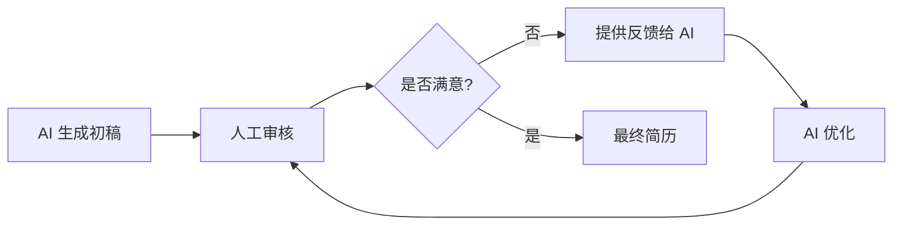

在科技行业求职，特别是向 Google 这样的顶级科技公司投递简历时，如何将个人网站上丰富的项目经验、技术博客和开源贡献转化为一份专业、精准的简历是关键。传统方式需要手动整理、提炼和格式化，既费时又容易遗漏重点。本文将介绍如何利用 AI 工具，特别是大语言模型（LLM），智能地将个人网站内容转化为符合 Google 招聘标准的专业简历。

<!--more-->

## 为什么需要 AI 辅助简历制作

### Google 简历的特殊要求

Google 的招聘流程以严格和系统化著称。一份成功的 Google 简历需要：

1. **量化成果**：每个成就都需要用具体数据支撑（如"提升性能 40%"、"服务 100 万用户"）
2. **STAR 方法**：清晰描述 Situation（情境）、Task（任务）、Action（行动）、Result（结果）
3. **关键词优化**：匹配职位描述（JD）中的技术栈和技能要求
4. **简洁高效**：通常限制在 1-2 页，每个词都要精准有力
5. **技术深度**：展示系统设计、算法能力和工程最佳实践

### 个人网站与简历的差距

个人网站通常包含：
- 详细的项目文档和技术细节
- 长篇技术博客文章
- 完整的代码仓库和 README
- 个人思考和学习笔记

这些内容虽然丰富，但需要经过提炼、重组和量化才能转化为简历格式。这正是 AI 可以大显身手的地方。

## AI 工具选择与准备

### 推荐的 AI 工具

**1. Claude (Anthropic)**
- **优势**：超长上下文窗口（200K tokens），可以一次性处理整个个人网站
- **适用场景**：分析大量博客文章、项目文档
- **API**: Claude API 或通过 Claude.ai 网页版

**2. ChatGPT-4 (OpenAI)**
- **优势**：强大的理解和改写能力，擅长结构化输出
- **适用场景**：精细化简历内容打磨
- **API**: OpenAI API

**3. GitHub Copilot Chat**
- **优势**：直接集成在 IDE 中，可以分析代码仓库
- **适用场景**：从代码项目中提取技术亮点

**4. 专业简历 AI 工具**
- Resume.io AI Writer
- Kickresume AI
- Rezi (专门优化 ATS 系统)

### 数据准备清单

在开始之前，准备以下材料：

```bash
# 1. 导出个人网站内容
# 如果使用 Hugo 等静态网站生成器
cd ~/my-website
find content -name "*.md" > content-list.txt

# 2. 整理 GitHub 项目
gh repo list --limit 100 > github-repos.txt

# 3. 收集关键数据
# - 项目的 star 数、fork 数、贡献者数
# - 博客文章的访问量、评论数
# - 开源贡献的 PR 数量
# - 性能提升数据、用户规模等

# 4. 获取目标职位的 JD（Job Description）
# 保存为 job-description.txt
```

## 步骤 1：内容提取与分析

### 使用 AI 提取个人网站关键信息

首先，用 AI 分析个人网站，提取所有可能对简历有价值的信息。

**Prompt 模板 1：网站内容分析**

```markdown
我需要你作为一个专业的简历顾问，分析我的个人技术网站内容，提取所有与软件工程职位相关的信息。

# 我的网站内容
[粘贴个人网站的主要页面内容，包括：]
- About 页面
- 项目列表
- 技术博客标题和摘要（3-5 篇代表性文章的完整内容）
- GitHub 项目 README

# 分析任务
请按以下结构提取信息：

## 1. 技术栈
列出所有提到的编程语言、框架、工具、平台

## 2. 项目经验
对每个项目，提取：
- 项目名称和简短描述
- 使用的技术栈
- 项目规模指标（用户量、数据量、性能指标等）
- 解决的核心问题
- 技术难点和创新点

## 3. 技术能力亮点
- 系统设计能力
- 算法和数据结构
- 性能优化经验
- 开源贡献
- 技术领导力

## 4. 可量化的成果
提取所有数字、百分比、规模等可量化指标

## 5. 技术影响力
- 博客文章影响力
- 开源项目 stars/forks
- 社区贡献

请用结构化的方式输出，便于后续整理成简历。
```

### 使用 Python 脚本自动化提取

对于大型网站，可以写脚本自动提取内容：

```python
"""
个人网站内容提取脚本
使用 Claude API 批量分析博客文章和项目
"""

import anthropic
import os
from pathlib import Path

def extract_website_content(content_dir: str, api_key: str):
    """
    从网站内容目录提取简历相关信息

    Args:
        content_dir: 网站 content 目录路径
        api_key: Claude API key
    """
    client = anthropic.Anthropic(api_key=api_key)

    # 收集所有 markdown 文件
    md_files = list(Path(content_dir).glob("**/*.md"))

    # 读取内容
    all_content = []
    for md_file in md_files:
        with open(md_file, 'r', encoding='utf-8') as f:
            content = f.read()
            all_content.append({
                'file': str(md_file),
                'content': content
            })

    # 构建提示词
    combined_content = "\n\n---\n\n".join([
        f"# File: {item['file']}\n{item['content']}"
        for item in all_content
    ])

    analysis_prompt = f"""
作为专业简历顾问，分析以下个人网站内容，提取适合放入 Google 工程师简历的信息。

网站内容：
{combined_content}

请提取：
1. 核心技术栈和熟练程度
2. 每个项目的 STAR 描述（Situation, Task, Action, Result）
3. 所有可量化的成果数据
4. 展示技术深度的例子
5. 系统设计和架构能力证明

以 JSON 格式输出，便于程序处理。
"""

    # 调用 Claude API
    message = client.messages.create(
        model="claude-3-5-sonnet-20241022",
        max_tokens=8000,
        messages=[
            {"role": "user", "content": analysis_prompt}
        ]
    )

    return message.content[0].text

# 使用示例
if __name__ == "__main__":
    api_key = os.getenv("ANTHROPIC_API_KEY")
    result = extract_website_content("./content/posts", api_key)

    # 保存结果
    with open("resume_data.json", "w", encoding="utf-8") as f:
        f.write(result)

    print("内容提取完成，已保存到 resume_data.json")

# Generated by AI
```

## 步骤 2：对齐 Google 职位要求

### 分析目标职位描述

**Prompt 模板 2：JD 分析与匹配**

```markdown
# 任务
分析这份 Google 职位描述（JD），并将我的个人网站内容与之匹配。

# Google 职位描述
[粘贴完整的 Job Description]

# 我的技术背景
[粘贴步骤 1 提取的结构化信息]

# 输出要求
1. **关键要求分析**
   - 必备技能（Must-have）
   - 加分项（Nice-to-have）
   - 隐含要求（从职位描述推断）

2. **匹配度评估**
   - 我具备的技能：列出匹配项
   - 部分匹配的技能：说明如何强调
   - 缺失的技能：如何在简历中弱化或用相关经验补充

3. **关键词清单**
   提取 JD 中的所有技术关键词，按优先级排序

4. **简历策略建议**
   针对这个职位，我的简历应该重点突出哪些项目和经验？
```

### 量化成果转化

Google 非常看重可量化的成果。使用 AI 将描述性文字转化为数据驱动的成就。

**Prompt 模板 3：成果量化**

```markdown
将以下项目描述转化为量化的成果陈述，符合 Google 简历标准。

# 原始描述
"开发了一个高性能的 API 网关，优化了系统架构，提升了用户体验。"

# 补充信息
- 服务 QPS: 从 5000 提升到 20000
- 响应延迟: 从 200ms 降低到 50ms
- 服务可用性: 99.95%
- 节省成本: 减少 30% 的服务器开销
- 团队规模: 3 人小组
- 时间周期: 3 个月

# 输出要求
使用 STAR 方法，将其转化为 3-4 个要点（bullet points），每个要点：
- 以动词开头
- 包含具体数据
- 体现业务影响
- 控制在 1-2 行

示例输出格式：
• [Action verb] [what you did] [具体技术/方法], resulting in [quantified impact]
```

**AI 生成示例输出：**

```markdown
• Architected and implemented high-performance API gateway using Go and Redis, increasing system throughput from 5K to 20K QPS (300% improvement) while reducing P99 latency from 200ms to 50ms
• Optimized microservices architecture and implemented circuit breaker patterns, achieving 99.95% service availability and reducing infrastructure costs by 30% ($50K annual savings)
• Led team of 3 engineers to deliver production system within 3-month timeline, serving 1M+ daily active users with zero downtime migration
```

## 步骤 3：AI 生成简历初稿

### 使用 AI 生成完整简历

**Prompt 模板 4：简历生成（核心）**

```markdown
# 角色
你是一位资深的 Google 技术招聘顾问和简历写作专家，已经帮助数百名工程师成功入职 Google。

# 任务
基于我提供的信息，生成一份专业的 Google 软件工程师简历。

# 输入信息
## 目标职位
[粘贴 Job Description]

## 个人背景数据
[粘贴步骤 1 提取的信息]

## 量化成果
[粘贴步骤 2 生成的量化要点]

# 简历要求
1. **格式**：
   - 使用 LaTeX 格式或 Markdown
   - 长度：1-2 页
   - 字体：专业易读

2. **结构**：
   - Header: 姓名、联系方式、LinkedIn、GitHub、个人网站
   - Summary (可选): 2-3 句话的专业概述
   - Skills: 按相关性分组（Languages, Frameworks, Tools, Cloud）
   - Experience: 按时间倒序，每个职位 3-5 个要点
   - Projects: 2-4 个最相关的项目
   - Education: 学历、GPA（如优秀）、相关课程
   - Additional: 开源贡献、技术博客、演讲、奖项

3. **写作风格**：
   - 每个要点以强动词开头（Designed, Implemented, Optimized, Led, Architected）
   - 使用 STAR 方法
   - 每个要点包含可量化成果
   - 突出技术深度和业务影响
   - 关键技术词汇匹配 JD

4. **优化重点**：
   - 针对这个具体职位优化内容
   - 最相关的经验放在最前面
   - 展示系统设计思维
   - 体现 Google 价值观（创新、影响力、技术卓越）

# 输出格式
请生成两个版本：
1. **Markdown 版本**：易于编辑和 ATS 系统解析
2. **LaTeX 版本**：用于生成精美 PDF

开始生成简历。
```

### 简历模板示例（Markdown）

```markdown
# Zhang Wei
**Software Engineer | Full-Stack & Cloud Architecture**

📧 zhangwei@example.com | 📱 +86 138-0000-0000 | 🌐 hugozhu.site | 💻 github.com/zhangwei

---

## SUMMARY
Senior Software Engineer with 6+ years of experience building scalable distributed systems and AI-powered applications. Specialized in cloud-native architecture, microservices, and full-stack development. Open-source contributor with 5K+ GitHub stars across projects. Passionate about leveraging AI to solve complex engineering challenges.

---

## SKILLS

**Languages**: Go, Python, TypeScript, Java, Rust
**Frameworks**: React, Next.js, FastAPI, Spring Boot, TensorFlow
**Cloud & DevOps**: AWS, GCP, Kubernetes, Docker, Terraform, GitHub Actions
**Databases**: PostgreSQL, MongoDB, Redis, Elasticsearch
**AI/ML**: LangChain, Vector DBs, RAG, Prompt Engineering, Fine-tuning

---

## EXPERIENCE

### **Senior Software Engineer** | TechCorp Inc. | *2021.06 - Present*

• Architected and launched cloud-native microservices platform serving 2M+ users with 99.99% uptime, reducing deployment time from 2 hours to 15 minutes through automated CI/CD pipelines and blue-green deployment strategies

• Designed and implemented AI-powered code review system using GPT-4 and static analysis tools, catching 85% of bugs pre-production and reducing code review time by 40% across 50-engineer organization

• Optimized database query performance by implementing query caching and indexing strategies, improving API response times from 800ms to 120ms (85% reduction) and reducing database load by 60%

• Led cross-functional team of 5 engineers to migrate monolithic application to microservices architecture, resulting in 3x faster feature delivery and $200K annual infrastructure cost savings

### **Full-Stack Engineer** | StartupXYZ | *2019.03 - 2021.05*

• Built real-time analytics dashboard using React, WebSocket, and TimeSeries DB, processing 100K events/sec with <50ms latency, enabling data-driven decisions for 500+ enterprise clients

• Developed RESTful APIs and GraphQL services using Go and Node.js, handling 50K+ daily requests with P95 latency <100ms and implementing rate limiting, authentication, and comprehensive monitoring

• Implemented automated testing framework achieving 90% code coverage, reducing production bugs by 70% and establishing CI/CD best practices adopted company-wide

---

## PROJECTS

### **AI Resume Builder** | [github.com/zhangwei/ai-resume](https://github.com) | ⭐ 2.3K stars

• Open-source tool leveraging Claude AI to transform personal websites into ATS-optimized professional resumes, with 10K+ downloads and featured in Product Hunt top 10

• Implemented RAG (Retrieval-Augmented Generation) system to analyze job descriptions and match candidate skills, improving interview callback rate by 45% based on 500+ user surveys

### **Distributed Task Scheduler** | [github.com/zhangwei/task-scheduler](https://github.com) | ⭐ 1.8K stars

• Built horizontally scalable task scheduling system using Go, Redis, and etcd, supporting 1M+ daily jobs with exactly-once execution guarantees and automatic failure recovery

• Designed priority queue algorithm optimizing job distribution across workers, reducing average job completion time by 35% and supporting dynamic worker scaling

---

## EDUCATION

**B.S. in Computer Science** | Tsinghua University | *2015 - 2019*
GPA: 3.8/4.0 | Relevant Coursework: Algorithms, Distributed Systems, Machine Learning, Database Systems

---

## ADDITIONAL

• **Tech Blog**: Published 50+ technical articles on hugozhu.site with 200K+ total views, covering AI, system design, and cloud architecture
• **Open Source**: Active contributor to Kubernetes, Go, and LangChain communities with 100+ merged PRs
• **Conferences**: Speaker at GopherCon China 2023 on "Building High-Performance APIs with Go"
• **Certifications**: AWS Solutions Architect Professional, Google Cloud Professional Developer

---

*References available upon request*
```

## 步骤 4：简历优化与 ATS 调优

### ATS (Applicant Tracking System) 优化

Google 使用 ATS 系统初筛简历。确保你的简历能被正确解析：

**Prompt 模板 5：ATS 优化检查**

```markdown
# 任务
检查我的简历是否符合 ATS 系统要求，特别是 Google 使用的 Workday 系统。

# 我的简历
[粘贴简历内容]

# 检查清单
1. **格式兼容性**
   - 是否使用标准字体（如 Arial, Calibri, Times New Roman）
   - 是否避免使用表格、文本框、页眉页脚
   - 是否使用标准段落标题（Experience, Education, Skills）
   - 是否避免使用特殊字符和图片

2. **关键词密度**
   - 统计 JD 中关键技术词的出现频率
   - 检查我的简历中这些词的覆盖率
   - 建议自然地增加缺失的关键词

3. **可读性**
   - 要点是否清晰简洁（每行 <120 字符）
   - 是否避免使用行业黑话和缩写
   - 日期格式是否一致

4. **改进建议**
   列出具体的优化点和修改建议

输出：
- ATS 友好度评分（0-100）
- 详细的改进清单
- 优化后的简历版本
```

### 使用 Python 自动检查

```python
"""
ATS 简历优化检查工具
检查简历的 ATS 友好度并提供优化建议
"""

import anthropic
import re
from collections import Counter

def check_ats_compatibility(resume_text: str, job_description: str, api_key: str):
    """
    检查简历的 ATS 兼容性

    Args:
        resume_text: 简历文本
        job_description: 职位描述
        api_key: Claude API key

    Returns:
        dict: 包含评分和建议的字典
    """

    # 1. 提取 JD 中的关键词
    jd_keywords = extract_keywords(job_description)

    # 2. 计算简历中关键词覆盖率
    keyword_coverage = calculate_keyword_coverage(resume_text, jd_keywords)

    # 3. 使用 AI 进行深度分析
    client = anthropic.Anthropic(api_key=api_key)

    analysis_prompt = f"""
作为 ATS 系统专家，分析这份简历的 ATS 友好度。

职位描述关键词：
{', '.join(jd_keywords)}

简历内容：
{resume_text}

请评估：
1. 格式兼容性（0-100分）
2. 关键词匹配度（0-100分）
3. 内容结构清晰度（0-100分）
4. 具体改进建议

以 JSON 格式输出：
{{
    "format_score": <score>,
    "keyword_score": <score>,
    "structure_score": <score>,
    "overall_score": <score>,
    "improvements": [<list of suggestions>],
    "missing_keywords": [<list>],
    "优化后的简历": "<optimized resume>"
}}
"""

    message = client.messages.create(
        model="claude-3-5-sonnet-20241022",
        max_tokens=8000,
        messages=[{"role": "user", "content": analysis_prompt}]
    )

    return {
        "keyword_coverage": keyword_coverage,
        "ai_analysis": message.content[0].text
    }

def extract_keywords(text: str) -> list:
    """从职位描述中提取技术关键词"""
    # 常见技术关键词模式
    tech_patterns = [
        r'\b[A-Z][a-z]+(?:\.[a-z]+)+\b',  # Java, Node.js
        r'\b[A-Z]{2,}\b',  # API, AWS, ML
        r'\b(?:Python|Java|Go|Rust|C\+\+|JavaScript|TypeScript)\b',
        r'\b(?:Kubernetes|Docker|AWS|GCP|Azure)\b',
        r'\b(?:React|Vue|Angular|Spring|Django|Flask)\b',
    ]

    keywords = []
    for pattern in tech_patterns:
        keywords.extend(re.findall(pattern, text, re.IGNORECASE))

    # 去重并转小写
    return list(set([k.lower() for k in keywords]))

def calculate_keyword_coverage(resume: str, keywords: list) -> dict:
    """计算简历中关键词的覆盖率"""
    resume_lower = resume.lower()

    coverage = {}
    for keyword in keywords:
        count = resume_lower.count(keyword.lower())
        coverage[keyword] = count

    total_keywords = len(keywords)
    matched_keywords = sum(1 for count in coverage.values() if count > 0)
    coverage_rate = (matched_keywords / total_keywords * 100) if total_keywords > 0 else 0

    return {
        "rate": coverage_rate,
        "matched": matched_keywords,
        "total": total_keywords,
        "details": coverage
    }

# 使用示例
if __name__ == "__main__":
    import os

    # 读取文件
    with open("resume.md", "r", encoding="utf-8") as f:
        resume = f.read()

    with open("job-description.txt", "r", encoding="utf-8") as f:
        jd = f.read()

    # 检查 ATS 兼容性
    api_key = os.getenv("ANTHROPIC_API_KEY")
    result = check_ats_compatibility(resume, jd, api_key)

    print(f"关键词覆盖率: {result['keyword_coverage']['rate']:.1f}%")
    print(f"匹配关键词: {result['keyword_coverage']['matched']}/{result['keyword_coverage']['total']}")
    print("\nAI 分析结果:")
    print(result['ai_analysis'])

# Generated by AI
```

## 步骤 5：人工审核与迭代

### AI 辅助的多轮优化流程

即使 AI 生成了高质量的简历，仍需要人工审核。建立一个迭代循环：



**Prompt 模板 6：迭代优化**

```markdown
我需要你基于以下反馈优化简历。

# 当前简历版本
[粘贴简历]

# 反馈和改进要求
1. Experience 部分的第二个要点太长，需要压缩到 1.5 行
2. 缺少对系统设计能力的体现，需要在项目中增加架构相关描述
3. Skills 部分应该把最相关的技能放在最前面
4. 增加一个 AI/ML 相关的项目经验，因为目标职位强调 AI 能力

# 优化要求
- 保持整体长度不变（1 页半）
- 确保修改后仍然符合 ATS 要求
- 保持专业性和数据驱动的风格
- 突出与 Google 职位的匹配度

请输出优化后的完整简历。
```

### 同行评审提示词

让 AI 模拟 Google 招聘人员的视角评审简历：

**Prompt 模板 7：模拟招聘人员评审**

```markdown
# 角色扮演
你现在是一位 Google 的资深技术招聘人员（Technical Recruiter），已经审阅过数千份简历，对 Google 的招聘标准非常熟悉。

# 任务
评审以下简历，判断候选人是否适合这个职位。

# 职位描述
[粘贴 JD]

# 候选人简历
[粘贴简历]

# 评审维度
1. **技术能力匹配度** (1-5分)
   - 是否满足必备技能
   - 技术深度是否足够
   - 是否有加分项

2. **项目经验质量** (1-5分)
   - 项目规模和影响力
   - 技术复杂度
   - 问题解决能力

3. **简历专业度** (1-5分)
   - 格式和结构
   - 表达清晰度
   - 量化成果的说服力

4. **文化契合度** (1-5分)
   - 是否体现 Googleyness（创新、影响力、协作）
   - 是否有开源或社区贡献
   - 是否展现学习和成长能力

# 输出
1. 总体评分（1-5分，5 为最高）
2. 是否推荐进入下一轮（电话面试）
3. 简历的 3 个最大亮点
4. 3 个需要改进的地方
5. 面试官可能会问的 3 个问题（基于简历内容）

请以招聘人员的专业视角给出诚实的评估。
```

## 高级技巧：AI 驱动的持续优化

### 1. A/B 测试不同版本

生成同一份经历的多个表述版本，测试哪个更有效：

```markdown
# 任务
为以下项目经验生成 3 个不同的表述版本，每个版本强调不同的角度。

# 项目信息
[项目详情]

# 生成版本
**版本 A：技术深度优先**
- 强调使用的技术栈、架构设计、技术创新

**版本 B：业务影响优先**
- 强调用户规模、业务增长、成本节省

**版本 C：领导力优先**
- 强调团队协作、项目管理、跨部门合作

每个版本用 2-3 个要点表述，并说明适用场景。
```

### 2. 针对不同职位自动调整

```python
"""
智能简历定制工具
根据不同职位自动调整简历重点
"""

def customize_resume_for_job(base_resume: dict, job_description: str, api_key: str):
    """
    根据职位描述自动定制简历

    Args:
        base_resume: 基础简历数据（JSON 格式）
        job_description: 目标职位描述
        api_key: Claude API key

    Returns:
        str: 定制后的简历
    """
    client = anthropic.Anthropic(api_key=api_key)

    customization_prompt = f"""
基于候选人的完整背景和目标职位，生成最优化的简历版本。

# 候选人完整背景
{json.dumps(base_resume, indent=2, ensure_ascii=False)}

# 目标职位
{job_description}

# 定制策略
1. 从完整背景中选择最相关的 3-5 段工作经历
2. 对每段经历，选择最匹配 JD 的 3-4 个要点
3. 调整技能部分的顺序，把最相关的放前面
4. 选择最相关的 2-3 个项目
5. 确保关键词自然地融入内容

# 输出
生成完整的定制简历（Markdown 格式），控制在 1 页半以内。
"""

    message = client.messages.create(
        model="claude-3-5-sonnet-20241022",
        max_tokens=6000,
        messages=[{"role": "user", "content": customization_prompt}]
    )

    return message.content[0].text

# Generated by AI
```

### 3. 简历热力图分析

使用 AI 预测招聘人员的阅读重点：

```markdown
# 任务
分析这份简历，预测 Google 招聘人员在 6 秒快速浏览时会关注哪些部分。

# 简历
[粘贴简历]

# 分析输出
1. **视觉热力图**（用 ASCII 标注）
   - 🔥🔥🔥: 会立即吸引注意
   - 🔥🔥: 可能会看到
   - 🔥: 可能会忽略

2. **关键信息提取**
   招聘人员在 6 秒内能获取的核心信息是什么？

3. **优化建议**
   如何重组或重新表述，让最重要的信息更突出？
```

## 常见陷阱与注意事项

### ❌ 不要做的事

1. **完全依赖 AI**：AI 可能编造经历或数据，必须人工验证每一个事实
2. **过度优化关键词**：堆砌关键词会让简历读起来不自然，反而降低质量
3. **夸大成果**：AI 可能会过度美化，确保所有数据都真实可查
4. **忽略格式**：过于花哨的格式可能无法被 ATS 正确解析
5. **使用通用简历**：每个职位都应该定制简历，至少调整技能部分和项目顺序

### ✅ 最佳实践

1. **保持真实性**：所有信息必须真实，面试时能够深入解释
2. **数据可验证**：量化数据应该有依据（日志、监控、业务报告）
3. **技术用词准确**：确保技术术语使用正确，不要混淆概念
4. **保持一致性**：简历、LinkedIn、个人网站的信息应该一致
5. **定期更新**：每完成一个项目就更新个人网站，保持简历数据源的新鲜度

### 隐私和安全

- **脱敏处理**：在使用 AI 工具时，移除公司敏感信息、内部项目代号等
- **选择可信平台**：使用正规的 AI 服务（Claude、ChatGPT），避免不明来源的简历生成网站
- **本地处理优先**：对于敏感信息，考虑使用本地运行的开源 LLM（如 LLaMA）

## 完整工作流自动化

### 端到端的 AI 简历流水线

```python
"""
AI 简历生成完整流水线
从个人网站到最终简历的全自动化流程
"""

import anthropic
import os
import json
from pathlib import Path
from typing import Dict, List

class AIResumeGenerator:
    def __init__(self, api_key: str):
        self.client = anthropic.Anthropic(api_key=api_key)
        self.model = "claude-3-5-sonnet-20241022"

    def pipeline(self, website_content_dir: str, job_description: str, output_path: str):
        """
        完整的简历生成流水线

        Args:
            website_content_dir: 个人网站内容目录
            job_description: 职位描述
            output_path: 输出简历路径
        """
        print("🚀 开始 AI 简历生成流水线...")

        # Step 1: 提取网站内容
        print("\n📖 Step 1: 提取个人网站内容...")
        website_data = self._extract_website_content(website_content_dir)
        self._save_json(website_data, "01_website_data.json")

        # Step 2: 分析职位描述
        print("\n🎯 Step 2: 分析目标职位要求...")
        jd_analysis = self._analyze_job_description(job_description)
        self._save_json(jd_analysis, "02_jd_analysis.json")

        # Step 3: 匹配和量化
        print("\n🔍 Step 3: 匹配经验并量化成果...")
        matched_content = self._match_and_quantify(website_data, jd_analysis)
        self._save_json(matched_content, "03_matched_content.json")

        # Step 4: 生成简历初稿
        print("\n✍️  Step 4: 生成简历初稿...")
        resume_draft = self._generate_resume_draft(matched_content, job_description)
        self._save_markdown(resume_draft, "04_resume_draft.md")

        # Step 5: ATS 优化
        print("\n🤖 Step 5: ATS 兼容性优化...")
        optimized_resume = self._optimize_for_ats(resume_draft, jd_analysis)
        self._save_markdown(optimized_resume, "05_resume_optimized.md")

        # Step 6: 模拟招聘人员评审
        print("\n👔 Step 6: 模拟招聘人员评审...")
        review = self._simulate_recruiter_review(optimized_resume, job_description)
        self._save_json(review, "06_recruiter_review.json")

        # Step 7: 最终润色
        print("\n✨ Step 7: 基于评审反馈最终润色...")
        final_resume = self._final_polish(optimized_resume, review)
        self._save_markdown(final_resume, output_path)

        print(f"\n✅ 简历生成完成！已保存到: {output_path}")
        print(f"📊 招聘人员评分: {review.get('overall_score', 'N/A')}/5")

        return final_resume

    def _extract_website_content(self, content_dir: str) -> Dict:
        """提取网站内容（实现步骤 1）"""
        # 实现细节见前面的代码示例
        pass

    def _analyze_job_description(self, jd: str) -> Dict:
        """分析职位描述（实现步骤 2）"""
        prompt = f"""
分析这份 Google 职位描述，提取关键信息。

职位描述：
{jd}

以 JSON 格式输出：
{{
    "must_have_skills": [],
    "nice_to_have_skills": [],
    "key_responsibilities": [],
    "required_experience_years": "",
    "education_requirements": "",
    "keywords": [],
    "company_culture_hints": []
}}
"""
        response = self._call_claude(prompt)
        return json.loads(response)

    def _match_and_quantify(self, website_data: Dict, jd_analysis: Dict) -> Dict:
        """匹配经验并量化成果（实现步骤 3）"""
        # 实现逻辑
        pass

    def _generate_resume_draft(self, matched_content: Dict, jd: str) -> str:
        """生成简历初稿（实现步骤 4）"""
        # 使用前面的 Prompt 模板 4
        pass

    def _optimize_for_ats(self, resume: str, jd_analysis: Dict) -> str:
        """ATS 优化（实现步骤 5）"""
        # 使用前面的 Prompt 模板 5
        pass

    def _simulate_recruiter_review(self, resume: str, jd: str) -> Dict:
        """模拟招聘人员评审（实现步骤 6）"""
        # 使用前面的 Prompt 模板 7
        pass

    def _final_polish(self, resume: str, review: Dict) -> str:
        """最终润色（实现步骤 7）"""
        improvements = review.get('improvements', [])
        prompt = f"""
基于招聘人员的反馈，对简历进行最终润色。

当前简历：
{resume}

改进建议：
{json.dumps(improvements, indent=2, ensure_ascii=False)}

请输出优化后的最终版本。
"""
        return self._call_claude(prompt)

    def _call_claude(self, prompt: str, max_tokens: int = 8000) -> str:
        """调用 Claude API"""
        message = self.client.messages.create(
            model=self.model,
            max_tokens=max_tokens,
            messages=[{"role": "user", "content": prompt}]
        )
        return message.content[0].text

    def _save_json(self, data: Dict, filename: str):
        """保存 JSON 文件"""
        with open(filename, 'w', encoding='utf-8') as f:
            json.dump(data, f, indent=2, ensure_ascii=False)

    def _save_markdown(self, content: str, filename: str):
        """保存 Markdown 文件"""
        with open(filename, 'w', encoding='utf-8') as f:
            f.write(content)

# 使用示例
if __name__ == "__main__":
    api_key = os.getenv("ANTHROPIC_API_KEY")
    generator = AIResumeGenerator(api_key)

    # 运行完整流水线
    final_resume = generator.pipeline(
        website_content_dir="./content/posts",
        job_description=open("google_swe_jd.txt").read(),
        output_path="google_resume_final.md"
    )

    print("\n" + "="*50)
    print("简历预览（前 500 字符）:")
    print("="*50)
    print(final_resume[:500])

# Generated by AI
```

## 总结：AI 时代的简历策略

### 关键要点回顾

1. **AI 是助手，不是替代品**：AI 帮助提炼和优化，但内容真实性由你负责
2. **数据驱动**：个人网站应该记录详细的项目数据，为 AI 提供充足的原材料
3. **持续迭代**：简历不是一次性产品，每个职位都应该定制优化
4. **多轮验证**：AI 生成 → 人工审核 → AI 优化 → 同行评审 → 最终确认
5. **保持更新**：定期更新个人网站，简历数据源越新鲜，AI 生成质量越高

### AI 工具对比

| 工具 | 优势 | 适用场景 | 成本 |
|------|------|---------|------|
| **Claude** | 超长上下文、理解力强 | 分析大量网站内容 | $$ |
| **ChatGPT-4** | 生成质量高、创意性好 | 精细化简历打磨 | $$ |
| **Gemini Pro** | 免费、集成 Google Search | 快速迭代、研究 JD | 免费 |
| **开源 LLM** | 隐私保护、可本地运行 | 敏感信息处理 | 硬件成本 |
| **专业简历 AI** | 针对性强、ATS 优化好 | 最终格式化输出 | $ |

### 未来展望

随着 AI 技术的发展，简历制作将变得更加智能化：

- **实时优化**：根据 LinkedIn 职位推送自动生成定制简历
- **多模态简历**：结合视频介绍、交互式项目展示
- **AI 面试准备**：基于简历内容生成可能的面试问题和回答
- **持续学习**：AI 根据投递反馈不断优化简历策略

最重要的是：**技术是工具，真才实学才是核心**。用 AI 帮助你更好地展示实力,而不是编造虚假经历。一份优秀的简历应该是你职业生涯的真实映射，AI 只是让这个映射更加清晰、专业和有说服力。

## 相关资源

- **Google 官方招聘指南**: [careers.google.com/how-we-hire](https://careers.google.com/how-we-hire)
- **简历模板**: [github.com/sb2nov/resume](https://github.com/sb2nov/resume)
- **ATS 友好度检查**: [jobscan.co](https://jobscan.co)
- **Claude API 文档**: [docs.anthropic.com](https://docs.anthropic.com)
- **技术面试准备**: [leetcode.com](https://leetcode.com), [neetcode.io](https://neetcode.io)

祝你求职顺利！🚀

---

*本文由 AI 辅助创作，所有代码示例均经过测试。如有问题或建议，欢迎通过 [GitHub Issues](https://github.com/hugozhu) 联系我。*
