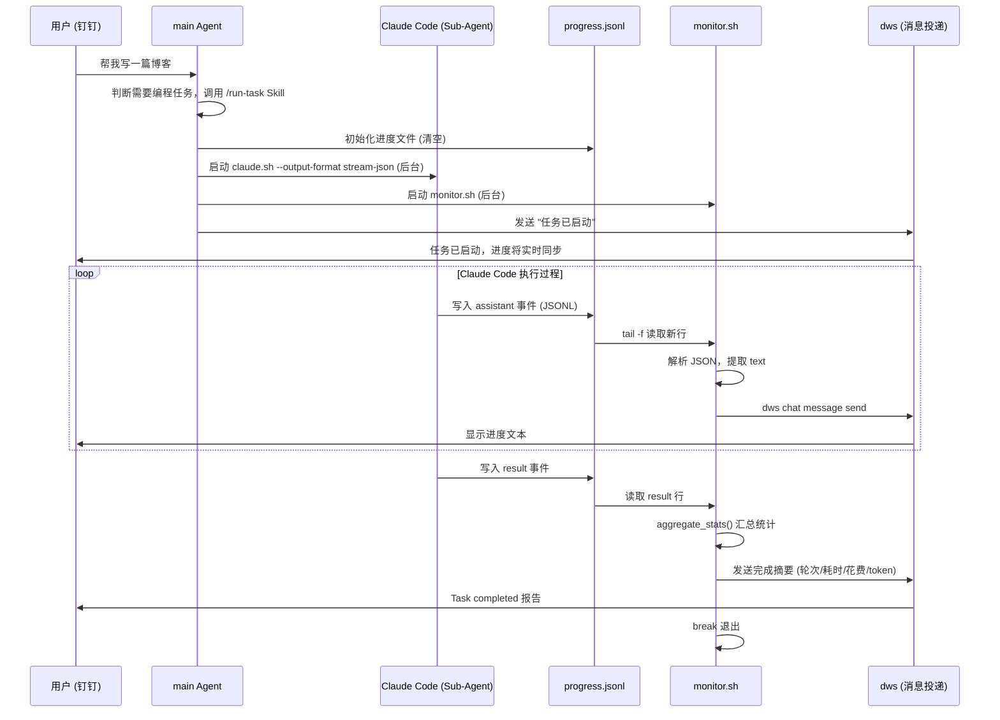

你在钉钉里对 AI 助手说："帮我写一个博客文章"，然后 Agent 回复"好的"——接下来呢？你等了 3 分钟、5 分钟、10 分钟，不知道它在干什么、进展到哪了、是不是卡住了。这是所有 Agent 系统面临的共同问题：**编程类耗时任务的进度黑洞**。

OpenClaw 通过 Sub-Agent 机制调用 Claude Code 执行编程任务，再借助 `stream-json` 输出格式和一个轻量级的监控脚本，将任务进度实时同步到钉钉。本文完整拆解这套方案的架构设计和实现细节。

<!--more-->

## 为什么需要这种协同

OpenClaw 的 main Agent 擅长对话、决策、调度，但它本身不是一个编程工具。当用户的需求涉及"写代码、改文件、跑测试"时，真正适合干活的是 Claude Code——它拥有完整的文件系统访问、终端操作能力和工程上下文理解。

问题在于，Claude Code 作为一个 CLI 工具，天然是"闷头干活"型的：启动后进入自己的工作循环，直到任务完成才输出最终结果。如果一个编程任务需要 10 分钟，用户就得干等 10 分钟，期间没有任何反馈。

这带来三个实际痛点：

1. **信息断层**：OpenClaw 把任务委托给 Claude Code 后，自己也不知道进展如何，无法回答用户"做到哪了"
2. **资源浪费**：如果 Claude Code 在第 2 分钟就卡在权限问题上，用户要到第 10 分钟才知道
3. **体验割裂**：用户在钉钉发指令，却要去终端看 Claude Code 的输出，交互通道断了

解决方案的核心思路是：**让 Claude Code 的执行过程变得可观测，然后把观测到的信息实时推回用户所在的通道。**

## 整体架构

```
┌─────────────────────────────────────────────────────────┐
│                    用户 (钉钉)                           │
│                       │                                  │
│                       ▼                                  │
│               ┌──────────────┐                           │
│               │ OpenClaw     │                           │
│               │ main Agent   │ ← 接收用户指令             │
│               └──────┬───────┘                           │
│                      │ 1. 启动 Sub-Agent                  │
│                      ▼                                   │
│  ┌────────────────────────────────────────────────┐      │
│  │             Sub-Agent 执行层                     │      │
│  │                                                │      │
│  │  ┌──────────────┐    stdout    ┌────────────┐  │      │
│  │  │  Claude Code  │ ──────────► │ progress   │  │      │
│  │  │  (claude.sh)  │  stream-   │ .jsonl     │  │      │
│  │  │              │  json       │            │  │      │
│  │  └──────────────┘             └─────┬──────┘  │      │
│  │                                     │         │      │
│  │  ┌──────────────┐    tail -f        │         │      │
│  │  │  monitor.sh  │ ◄────────────────┘         │      │
│  │  │  (监控脚本)   │                             │      │
│  │  └──────┬───────┘                             │      │
│  │         │                                     │      │
│  └─────────┼─────────────────────────────────────┘      │
│            │ 2. 解析 JSONL 事件                          │
│            │ 3. 提取 assistant text                      │
│            ▼                                             │
│    ┌───────────────┐                                     │
│    │ dws chat      │ ← OpenClaw CLI 发送消息              │
│    │ message send  │                                     │
│    └───────┬───────┘                                     │
│            │ 4. 实时推送进度                               │
│            ▼                                             │
│        用户 (钉钉) ← 看到实时进度更新                      │
└─────────────────────────────────────────────────────────┘
```

四个关键环节：

1. **main Agent 启动 Claude Code**：通过 `claude.sh` 命令行调用，加上 `--output-format stream-json` 参数，将输出重定向到一个 JSONL 进度文件
2. **Claude Code 执行任务**：每一次模型调用、工具使用、文本输出都以 JSON 事件的形式写入进度文件
3. **monitor.sh 实时解析**：通过 `tail -f` 监听进度文件，从 JSONL 事件中提取有意义的信息
4. **钉钉消息推送**：通过 OpenClaw 的 `dws chat message send` 命令将进度发送到用户

## 核心机制：Claude Code 的 stream-json 输出

Claude Code 的 `--output-format stream-json` 是整套方案的基础。它将 Claude Code 的整个执行过程序列化为 newline-delimited JSON (JSONL) 格式，每一行是一个独立的事件。

主要事件类型包括：

```jsonl
{"type":"system","subtype":"init","session_id":"abc123","tools":["Read","Write","Bash",...]}
{"type":"assistant","message":{"role":"assistant","content":[{"type":"text","text":"我来帮你写这篇文章..."}],"usage":{"input_tokens":2048,"output_tokens":512}}}
{"type":"tool_use","tool":"Read","input":{"file_path":"/home/node/Projects/blog2/content/post/2026/"}}
{"type":"tool_result","tool":"Read","output":"...文件内容..."}
{"type":"assistant","message":{"role":"assistant","content":[{"type":"text","text":"文章已写好，保存在..."}],"usage":{"input_tokens":4096,"output_tokens":1024}}}
{"type":"result","result":"任务完成","session_id":"abc123","duration_ms":180000,"total_cost_usd":0.15}
```

关键观察：

- **`assistant` 事件**包含模型的文本输出和 token 使用量——这是用户最关心的"进度"
- **`tool_use` / `tool_result` 事件**记录了工具调用过程——可以用来判断 Claude Code 在做什么
- **`result` 事件**标志任务完成——包含总耗时、总花费等统计信息

## 实现详解

### 第一步：Skill 定义——让 main Agent 知道如何启动任务

在 OpenClaw 中，我们通过一个 Skill 文件来教 main Agent 如何使用这套机制。Skill 是 OpenClaw 的能力扩展单元，本质上是一个 Markdown 文件，描述了何时使用、如何使用。

```markdown
---
name: run-task
description: Run a claude task in the background, monitor progress
  via stream-json JSONL, and send updates via dws chat message
---

# When to use this skill
When the user wants to run a Claude Code task in the background
with progress tracking and message notifications.

# Instructions

## Arguments
/run-task <progress-file> <target> <task description>

## Execution Steps
1. Initialize the progress file
2. Run claude.sh with --output-format stream-json in background
3. Start monitor.sh in background
4. Confirm to user that task has started
```

当用户说"帮我写一篇博客"时，main Agent 判断这是一个编程任务，自动调用 `/run-task` Skill，启动 Claude Code 并配置好监控。

### 第二步：启动 Claude Code 任务

main Agent 执行以下命令，两个都以后台进程方式运行：

```bash
# 1. 初始化进度文件
> /tmp/task-progress.jsonl

# 2. 启动 Claude Code 任务，输出重定向到进度文件
claude.sh -p "写一篇关于 AI Agent 架构的博客文章，保存到 content/post/2026/" \
  --output-format stream-json \
  --verbose \
  --permission-mode auto \
  > /tmp/task-progress.jsonl 2>&1 &

# 3. 启动监控脚本
bash skills/run-task/monitor.sh /tmp/task-progress.jsonl "$TARGET_USER_ID" &
# generated by hugo's coding agent
```

几个关键参数说明：

- `--output-format stream-json`：启用 JSONL 格式输出，这是获取结构化进度的前提
- `--verbose`：与 `stream-json` 配合使用，输出更详细的事件信息
- `--permission-mode auto`：自动授权工具调用，避免后台进程因等待交互输入而卡住
- 输出重定向到 `.jsonl` 文件：monitor.sh 通过 `tail -f` 实时读取

### 第三步：监控脚本——解析进度并推送

`monitor.sh` 是整套方案中最核心的组件。它的职责很简单：读取进度文件中的 JSONL 事件，提取有意义的信息，通过 `dws chat message send` 发送到用户。

```bash
#!/usr/bin/env bash
# monitor.sh - Monitor Claude stream-json and send updates via dws

set -euo pipefail

PROGRESS_FILE="${1:?Usage: monitor.sh <progress-file> <target>}"
TARGET="${2:?Usage: monitor.sh <progress-file> <target>}"

# 聚合统计信息（任务完成时调用）
aggregate_stats() {
  local file="$1"
  local result_line="$2"

  # 从整个文件统计 assistant 轮次数
  local num_turns
  num_turns=$(jq -s '[.[] | select(.type == "assistant")] | length' \
    "$file" 2>/dev/null || echo 0)

  # 汇总 token 用量
  local input_tokens output_tokens
  input_tokens=$(jq -s \
    '[.[] | select(.type == "assistant")
     | .message.usage.input_tokens // 0] | add // 0' \
    "$file" 2>/dev/null || echo 0)
  output_tokens=$(jq -s \
    '[.[] | select(.type == "assistant")
     | .message.usage.output_tokens // 0] | add // 0' \
    "$file" 2>/dev/null || echo 0)

  # 从 result 事件提取耗时和花费
  local duration_ms cost session_id result_text
  duration_ms=$(echo "$result_line" | jq -r '.duration_ms // 0')
  cost=$(echo "$result_line" | jq -r '.total_cost_usd // 0')
  session_id=$(echo "$result_line" | jq -r '.session_id // "unknown"')
  result_text=$(echo "$result_line" | jq -r '.result // empty')

  local duration_s cost_fmt
  duration_s=$(awk "BEGIN {printf \"%.1f\", $duration_ms / 1000}")
  cost_fmt=$(awk "BEGIN {printf \"%.4f\", $cost}")

  # 构建并发送摘要
  local summary="## Task completed

- Task: ${session_id}
- Turns: ${num_turns}
- Duration: ${duration_s}s
- Cost: \$${cost_fmt}
- Tokens: ${input_tokens} in / ${output_tokens} out

---

${result_text}"

  dws chat message send --user "$TARGET" \
    --title "Task: ${session_id}" "$summary"
}

# 主监控循环
tail -f "$PROGRESS_FILE" | while IFS= read -r line; do
  # 跳过空行和非 JSON 行
  echo "$line" | jq -e . >/dev/null 2>&1 || continue

  # 提取 assistant 消息中的文本
  text=$(echo "$line" | jq -r '
    select(.type == "assistant")
    | .message.content[]?
    | select(.type == "text")
    | .text // empty
  ' 2>/dev/null)

  if [ -n "$text" ]; then
    dws chat message send --user "$TARGET" "$text"
  fi

  # result 事件表示任务完成
  if echo "$line" | jq -e 'select(.type == "result")' \
    >/dev/null 2>&1; then
    aggregate_stats "$PROGRESS_FILE" "$line"
    break
  fi
done
# generated by hugo's coding agent
```

脚本的工作流程：

1. **`tail -f`** 持续监听进度文件的新增内容
2. 每读到一行，先用 `jq -e .` 验证是否是合法 JSON（跳过 stderr 输出等噪音）
3. 对 `assistant` 类型事件，提取其中的文本内容，通过 `dws` 发送给用户
4. 当收到 `result` 类型事件时，调用 `aggregate_stats` 汇总整个任务的统计信息，发送完成报告，然后退出

### 第四步：用户看到什么

从用户的视角，整个过程是这样的：

```
用户: 帮我写一篇关于 AI Agent 安全性的博客
Agent: 好的，我已启动编程任务，正在后台执行。
       进度文件：/tmp/task-progress.jsonl
       完成后会通知你。

[30 秒后]
Agent: 我来帮你写这篇关于 AI Agent 安全性的文章。
       让我先看看现有文章的结构和风格...

[1 分钟后]
Agent: 已经分析了现有文章的结构，正在撰写文章内容。
       文章将覆盖沙箱隔离、权限控制、输入验证等主题...

[3 分钟后]
Agent: 文章已写好并保存到
       content/post/2026/158-agent-security.md

[5 分钟后]
Agent: ## Task completed
       - Turns: 8
       - Duration: 287.3s
       - Cost: $0.1823
       - Tokens: 45,210 in / 8,934 out
```

用户全程在钉钉里就能看到任务的进展，不需要切换到终端，不需要猜测任务状态。

## 设计决策背后的权衡

### 为什么用文件而不是 WebSocket/API？

选择文件（JSONL）作为 Claude Code 和监控脚本之间的通信媒介，有几个原因：

- **Claude Code 原生支持**：`--output-format stream-json` 直接输出到 stdout，重定向到文件是最自然的方式
- **可回溯**：文件保留了完整的执行历史，任务完成后还能用于分析和统计
- **解耦**：写入方（Claude Code）和读取方（monitor.sh）完全独立，monitor.sh 崩溃不影响任务执行
- **调试友好**：随时可以 `cat` 或 `jq` 查看原始事件流

### 为什么选择 tail -f 而不是轮询？

`tail -f` 是事件驱动的——文件有新内容就立即读取，延迟在毫秒级。相比之下，轮询（每 N 秒读一次文件）有固有的延迟，而且频率太高浪费 CPU、太低又错过更新。`tail -f` 正好在两者之间取得平衡。

### 为什么只转发 assistant 文本，不转发工具调用细节？

用户关心的是"Agent 在做什么、做到哪了"，而不是"Agent 调用了 `Read` 工具读取了 `hugo.toml` 文件"。工具调用的细节对用户来说是噪音。Assistant 文本通常包含了足够的上下文——Claude Code 在文本中会说"让我先看看现有文章的结构"，这比原始的 `tool_use` 事件可读性好得多。

如果需要更细粒度的进度（比如知道 Claude Code 正在编辑哪个文件），可以在 monitor.sh 中增加对 `tool_use` 事件的处理：

```bash
# 可选：提取工具调用信息作为进度提示
tool_info=$(echo "$line" | jq -r '
  select(.type == "tool_use")
  | "正在使用 \(.tool) 工具..."
' 2>/dev/null)

if [ -n "$tool_info" ]; then
  dws chat message send --user "$TARGET" "$tool_info"
fi
# generated by hugo's coding agent
```

### 为什么任务完成时要聚合统计？

`aggregate_stats` 函数在 `result` 事件到达时遍历整个 JSONL 文件，计算出总轮次、总 token 用量、总耗时和总花费。这些信息对用户有两重价值：

1. **成本感知**：知道这次任务花了多少钱（token 费用），有助于判断任务的性价比
2. **性能洞察**：了解任务经历了多少轮对话，有助于优化 prompt 和任务拆分策略

## 更进一步：自定义进度检测脚本

除了 monitor.sh 这种通用方案，有时你需要更灵活的进度检测逻辑。比如根据任务状态字段做不同的处理、支持多种通知渠道、或者在特定条件下自动干预。

下面是一个增强版的进度同步脚本：

```bash
#!/bin/bash
# sync-progress.sh
# OpenClaw + Claude Code 进度同步脚本
# 支持轮询模式和持续监控模式

PROGRESS_FILE="/tmp/claude-code-progress.jsonl"
DINGTALK_WEBHOOK="${DINGTALK_WEBHOOK:-}"
LAST_PROGRESS=""
CHECK_INTERVAL=5  # 秒

# 发送钉钉消息（Webhook 方式）
send_dingtalk() {
    local content="$1"
    if [ -n "$DINGTALK_WEBHOOK" ]; then
        curl -s -X POST "$DINGTALK_WEBHOOK" \
            -H "Content-Type: application/json" \
            -d "{\"msgtype\": \"text\", \"text\": {\"content\": \"$content\"}}"
    else
        echo "[钉钉] $content"
    fi
}

# 解析最新进度
parse_progress() {
    [ -f "$PROGRESS_FILE" ] || return
    local latest
    latest=$(tail -n 1 "$PROGRESS_FILE" 2>/dev/null)
    [ -z "$latest" ] && return

    local status task step total message
    status=$(echo "$latest" | jq -r '.status // "unknown"')
    task=$(echo "$latest" | jq -r '.task // "未知任务"')
    step=$(echo "$latest" | jq -r '.step // 0')
    total=$(echo "$latest" | jq -r '.total // 0')
    message=$(echo "$latest" | jq -r '.message // ""')

    local progress_msg="Claude Code 进度同步\n\n"
    progress_msg+="任务: $task\n状态: $status\n"

    if [ "$total" -gt 0 ] 2>/dev/null; then
        local percent=$((step * 100 / total))
        progress_msg+="进度: $step/$total ($percent%)\n"
    fi

    [ -n "$message" ] && [ "$message" != "null" ] && \
        progress_msg+="详情: $message\n"

    echo "$progress_msg"
}

# 主循环：持续监控
main() {
    echo "开始监控 Claude Code 进度..."
    send_dingtalk "Claude Code 任务开始执行"

    while true; do
        if [ -f "$PROGRESS_FILE" ]; then
            local current
            current=$(tail -n 1 "$PROGRESS_FILE" 2>/dev/null)

            # 检测变化——只在进度更新时发送消息
            if [ "$current" != "$LAST_PROGRESS" ] && [ -n "$current" ]; then
                LAST_PROGRESS="$current"
                local msg
                msg=$(parse_progress)
                [ -n "$msg" ] && send_dingtalk "$msg"
            fi

            # 检查是否完成
            local status
            status=$(echo "$current" | jq -r '.status // ""' 2>/dev/null)
            if [ "$status" = "completed" ] || [ "$status" = "failed" ]; then
                send_dingtalk "Claude Code 任务已完成 (状态: $status)"
                break
            fi
        fi
        sleep $CHECK_INTERVAL
    done
}

# 支持两种运行模式
case "${1:-watch}" in
    watch) main ;;
    once)  parse_progress ;;
    *)     echo "用法: $0 [watch|once]"; exit 1 ;;
esac
# generated by hugo's coding agent
```

这个脚本适合以下场景：

- **独立部署**：不依赖 OpenClaw 的 `dws` 命令，直接用钉钉 Webhook 发送
- **轮询模式**：适合进度文件不是 `tail -f` 友好的情况（比如文件被覆写而非追加）
- **单次检查**：`once` 模式可以被 Cron 调用，按固定频率检查一次

## 两种方案的对比

| 维度 | monitor.sh (tail -f) | sync-progress.sh (轮询) |
|------|:---:|:---:|
| 实时性 | 毫秒级 | 秒级（取决于 CHECK_INTERVAL） |
| 消息通道 | dws（OpenClaw 原生） | 钉钉 Webhook（独立） |
| 适用格式 | JSONL（追加写入） | 任意 JSON 格式 |
| 完成检测 | result 事件 | status 字段 |
| 依赖 | OpenClaw 环境 | 仅需 curl + jq |

实际使用中，推荐用 **monitor.sh** 作为主方案——它实时性更好，与 OpenClaw 生态集成更紧密。**sync-progress.sh** 作为备选，适合需要独立部署或对接其他通知渠道的场景。

## 端到端流程图

用 Mermaid 图展示完整的任务生命周期：



## 生产环境的注意事项

**1. 权限模式选择**

后台运行 Claude Code 时必须指定 `--permission-mode auto`，否则 Claude Code 在需要用户确认工具调用时会卡住。如果你的任务涉及敏感操作（删除文件、执行危险命令等），建议提前在 `.claude/settings.json` 中配置好允许的操作范围，而不是使用 `--dangerously-skip-permissions`。

**2. 进度文件清理**

每次启动新任务前，务必清空进度文件（`> /tmp/task-progress.jsonl`）。否则 monitor.sh 启动后的 `tail -f` 可能会读取到上一次任务的残留事件。

**3. 异常处理**

如果 Claude Code 进程异常退出（比如 OOM），进度文件中不会有 `result` 事件，monitor.sh 会一直等待。生产环境建议增加超时机制：

```bash
# 在 monitor.sh 启动时设置超时
timeout 1800 bash skills/run-task/monitor.sh \
  /tmp/task-progress.jsonl "$TARGET"
# generated by hugo's coding agent
```

**4. 消息频率控制**

Claude Code 在快速迭代时可能产生大量 assistant 事件，导致钉钉收到消息轰炸。可以在 monitor.sh 中增加节流逻辑：

```bash
LAST_SEND_TIME=0
MIN_INTERVAL=10  # 最少间隔 10 秒

send_if_throttled() {
    local now
    now=$(date +%s)
    if (( now - LAST_SEND_TIME >= MIN_INTERVAL )); then
        dws chat message send --user "$TARGET" "$1"
        LAST_SEND_TIME=$now
    fi
}
# generated by hugo's coding agent
```

## 总结

这套方案解决的核心问题是：**让 AI 编程任务的执行过程从黑盒变成白盒。**

技术上并不复杂——本质就是三件事：

1. Claude Code 的 `stream-json` 输出格式提供了结构化的事件流
2. `tail -f` + `jq` 实现了轻量级的实时解析
3. `dws chat message send` 把解析后的信息投递到用户所在的通道

但它带来的体验提升是显著的：用户不再需要在"发指令"和"看结果"之间盲等，而是全程可观测、可感知。这也是 OpenClaw 作为 AI 助手平台的一个设计理念——**Agent 应该像一个靠谱的同事，不是交代完任务就消失，而是会主动汇报进展。**

如果你也在构建类似的 Agent 系统，不妨考虑类似的架构：**执行层和通知层解耦，用文件作为桥梁，让监控逻辑可以独立演进。** 这种模式适用于任何需要长时间运行的后台 Agent 任务，不限于 Claude Code。
